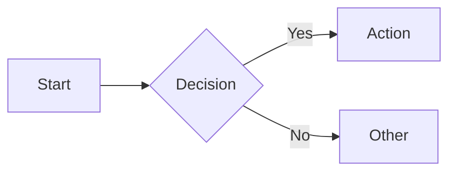
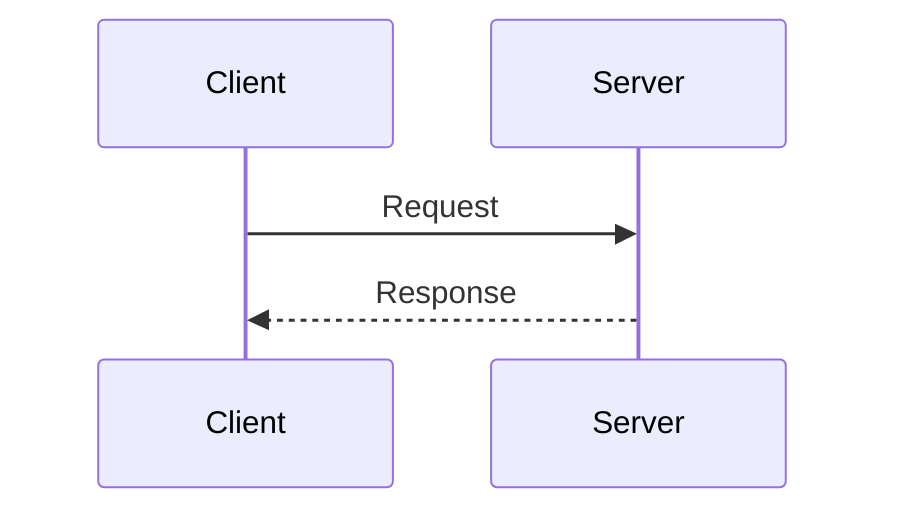
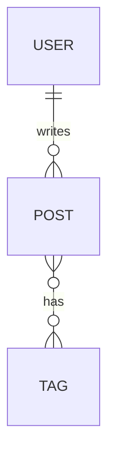
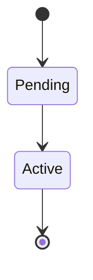

# Diagrams as Code

This directory contains architecture and system diagrams written as code using Mermaid.

## Why Diagrams as Code?

- **Version controlled** - Track changes to architecture over time
- **Reviewable** - Include in PRs alongside code changes
- **Always current** - Update diagrams with implementation
- **No special tools** - Renders in GitHub, VS Code, and most markdown viewers

## Diagram Types

| File | Purpose | Mermaid Type |
|------|---------|--------------|
| `architecture.md` | High-level system architecture | Flowchart |
| `sequence-auth.md` | Authentication flow | Sequence |
| `erd.md` | Database entity relationships | ERD |
| `state-order.md` | State machine (e.g., order status) | State |
| `c4-context.md` | C4 context diagram | Flowchart |

## Rendering Diagrams

### GitHub/GitLab
Mermaid diagrams render automatically in markdown files.

### VS Code
Install the "Markdown Preview Mermaid Support" extension.

### CLI Export
```bash
# Install mermaid CLI
npm install -g @mermaid-js/mermaid-cli

# Export to PNG
mmdc -i docs/diagrams/architecture.md -o docs/diagrams/architecture.png

# Export to SVG
mmdc -i docs/diagrams/architecture.md -o docs/diagrams/architecture.svg
```

### In Documentation
```markdown
<!-- In your README or docs -->

```

## Mermaid Quick Reference

### Flowchart


### Sequence


### ERD


### State


## Best Practices

1. **One diagram per file** - Easier to maintain and reference
2. **Add context** - Include a brief description above each diagram
3. **Keep it simple** - If a diagram is too complex, split it
4. **Update with code** - Include diagram updates in feature PRs
5. **Use consistent styling** - Follow patterns in existing diagrams

## See Also

- [Mermaid Documentation](https://mermaid.js.org/)
- [Mermaid Live Editor](https://mermaid.live/)
