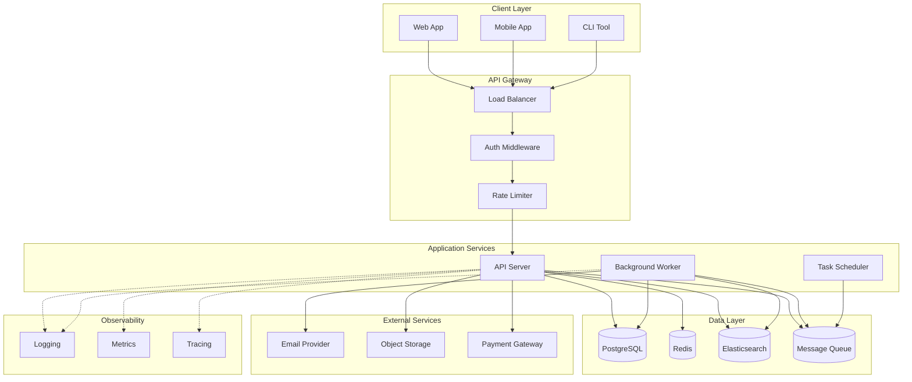

# System Architecture

High-level overview of the system components and their interactions.

## Components

| Component | Technology | Purpose |
|-----------|------------|---------|
| Web App | React/Next.js | User-facing web interface |
| API Server | Node.js/Go | REST/GraphQL API |
| Worker | Node.js/Python | Background job processing |
| PostgreSQL | PostgreSQL 15+ | Primary data store |
| Redis | Redis 7+ | Caching, sessions, rate limiting |
| Queue | Redis/RabbitMQ | Async job processing |
