# C4 Context Diagram

System context showing how the application fits into the broader ecosystem.

## Level 1: System Context

```mermaid
flowchart TB
    subgraph boundary [System Boundary]
        SYSTEM[("🖥️ Our Application
        [Software System]

        Provides core functionality
        to users")]
    end

    USER["👤 User
    [Person]

    Uses the application
    to accomplish tasks"]

    ADMIN["👤 Administrator
    [Person]

    Manages system
    configuration"]

    EMAIL["📧 Email Service
    [External System]

    SendGrid / AWS SES
    Sends transactional emails"]

    PAYMENT["💳 Payment Gateway
    [External System]

    Stripe
    Processes payments"]

    STORAGE["☁️ Object Storage
    [External System]

    AWS S3 / Cloudflare R2
    Stores files and media"]

    ANALYTICS["📊 Analytics
    [External System]

    Mixpanel / Amplitude
    Tracks user behavior"]

    MONITORING["📈 Monitoring
    [External System]

    Datadog / Grafana
    System observability"]

    USER -->|Uses| SYSTEM
    ADMIN -->|Configures| SYSTEM
    SYSTEM -->|Sends emails via| EMAIL
    SYSTEM -->|Processes payments via| PAYMENT
    SYSTEM -->|Stores files in| STORAGE
    SYSTEM -->|Reports events to| ANALYTICS
    SYSTEM -.->|Sends metrics to| MONITORING

    classDef person fill:#08427b,stroke:#052e56,color:#fff
    classDef system fill:#1168bd,stroke:#0b4884,color:#fff
    classDef external fill:#999999,stroke:#6b6b6b,color:#fff

    class USER,ADMIN person
    class SYSTEM system
    class EMAIL,PAYMENT,STORAGE,ANALYTICS,MONITORING external
```

## Level 2: Container Diagram

```mermaid
flowchart TB
    subgraph boundary [Application Boundary]
        WEB["🌐 Web Application
        [Container: Next.js]

        Server-rendered React app
        User interface"]

        API["⚙️ API Server
        [Container: Node.js]

        REST/GraphQL API
        Business logic"]

        WORKER["⚡ Background Worker
        [Container: Node.js]

        Async job processing
        Scheduled tasks"]

        DB[("🗃️ Database
        [Container: PostgreSQL]

        Primary data store
        User data, content")]

        CACHE[("⚡ Cache
        [Container: Redis]

        Session storage
        Rate limiting")]

        QUEUE[("📬 Message Queue
        [Container: Redis/RabbitMQ]

        Job queue
        Event bus")]
    end

    USER["👤 User"]

    USER -->|HTTPS| WEB
    WEB -->|API calls| API
    API -->|Read/Write| DB
    API -->|Cache| CACHE
    API -->|Enqueue jobs| QUEUE
    WORKER -->|Process jobs| QUEUE
    WORKER -->|Read/Write| DB

    classDef container fill:#1168bd,stroke:#0b4884,color:#fff
    classDef database fill:#438dd5,stroke:#2e6295,color:#fff
    classDef person fill:#08427b,stroke:#052e56,color:#fff

    class WEB,API,WORKER container
    class DB,CACHE,QUEUE database
    class USER person
```

## C4 Legend

| Element | Description |
|---------|-------------|
| **Person** | Human user of the system |
| **Software System** | The highest level of abstraction |
| **Container** | Applications, data stores, microservices |
| **Component** | Logical groupings within a container |

## References

- [C4 Model](https://c4model.com/)
- [Structurizr](https://structurizr.com/) - C4 modeling tool
