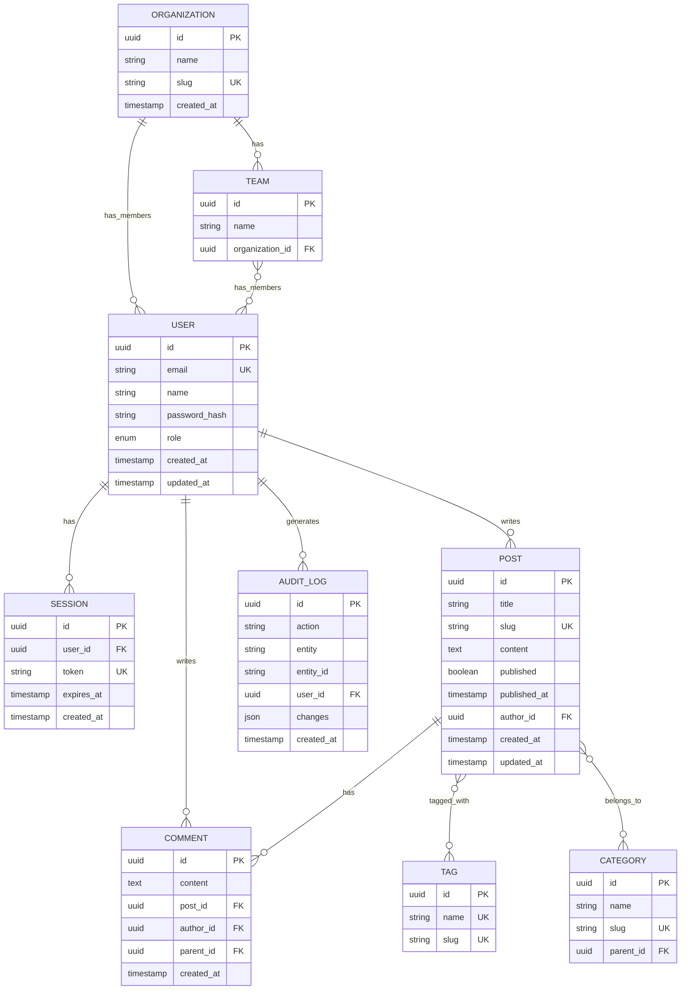

# Entity Relationship Diagram

Database schema and relationships.

## Relationship Key

| Symbol | Meaning |
|--------|---------|
| `\|\|` | Exactly one |
| `o{` | Zero or more |
| `\|{` | One or more |
| `o\|` | Zero or one |

## Notes

- **PK** = Primary Key
- **FK** = Foreign Key
- **UK** = Unique Key
- All tables have `id` as UUID primary key
- Timestamps use `TIMESTAMP WITH TIME ZONE`
- Soft deletes use `deleted_at` column (not shown for brevity)
