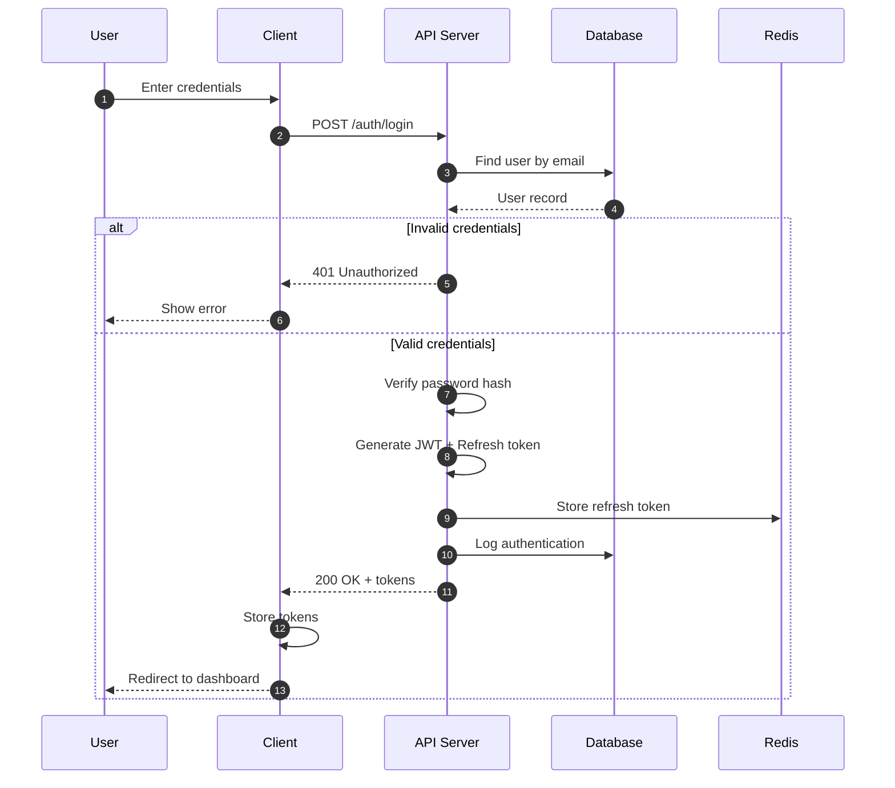
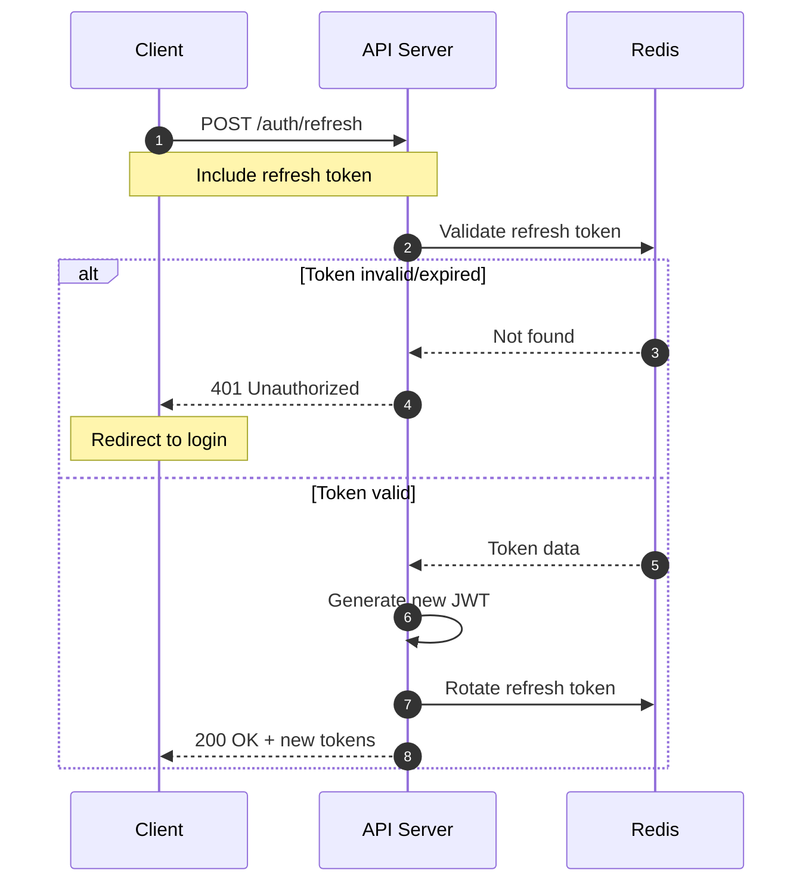
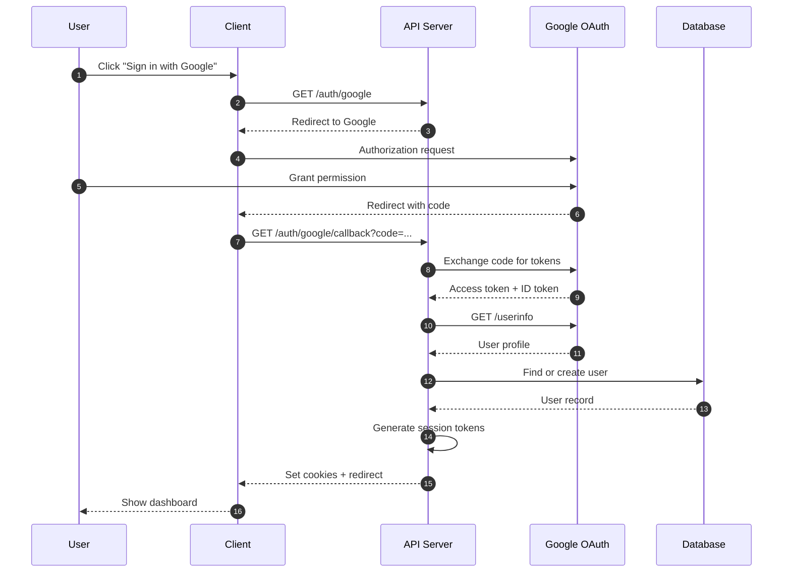
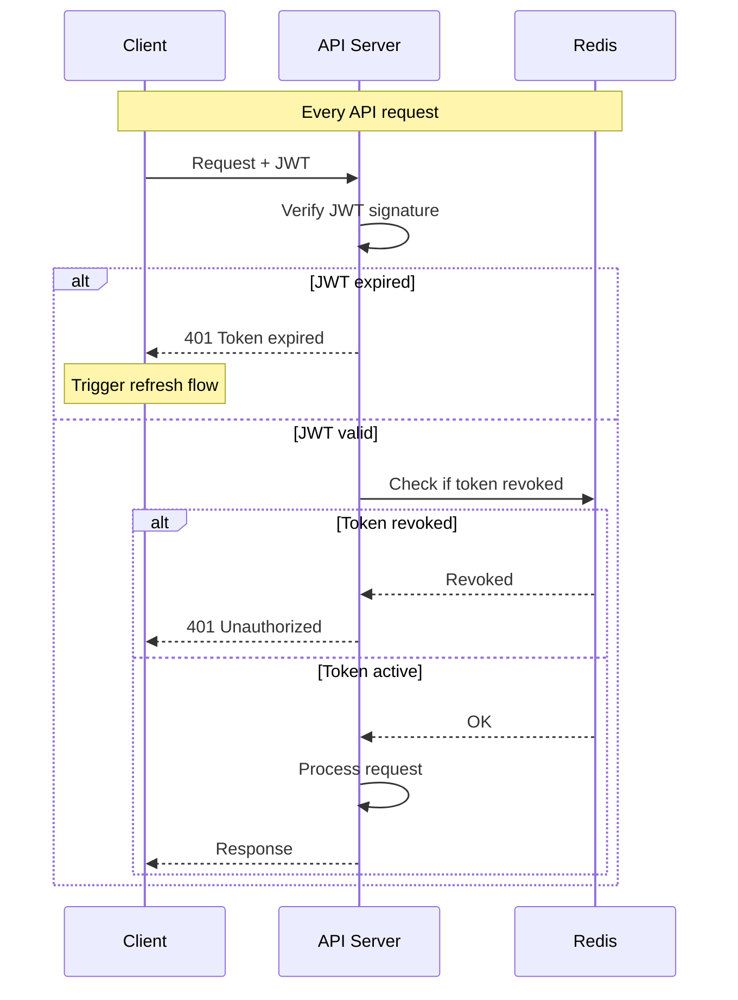

# Authentication Flow

Sequence diagram showing the authentication process.

## Login Flow

```mermaid
sequenceDiagram
    autonumber
    participant U as User
    participant C as Client
    participant A as API Server
    participant D as Database
    participant R as Redis

    U->>C: Enter credentials
    C->>A: POST /auth/login
    A->>D: Find user by email
    D-->>A: User record

    alt Invalid credentials
        A-->>C: 401 Unauthorized
        C-->>U: Show error
    else Valid credentials
        A->>A: Verify password hash
        A->>A: Generate JWT + Refresh token
        A->>R: Store refresh token
        A->>D: Log authentication
        A-->>C: 200 OK + tokens
        C->>C: Store tokens
        C-->>U: Redirect to dashboard
    end
```

## Token Refresh Flow

```mermaid
sequenceDiagram
    autonumber
    participant C as Client
    participant A as API Server
    participant R as Redis

    C->>A: POST /auth/refresh
    Note over C,A: Include refresh token

    A->>R: Validate refresh token

    alt Token invalid/expired
        R-->>A: Not found
        A-->>C: 401 Unauthorized
        Note over C: Redirect to login
    else Token valid
        R-->>A: Token data
        A->>A: Generate new JWT
        A->>R: Rotate refresh token
        A-->>C: 200 OK + new tokens
    end
```

## OAuth Flow (Google Example)

```mermaid
sequenceDiagram
    autonumber
    participant U as User
    participant C as Client
    participant A as API Server
    participant G as Google OAuth
    participant D as Database

    U->>C: Click "Sign in with Google"
    C->>A: GET /auth/google
    A-->>C: Redirect to Google
    C->>G: Authorization request
    U->>G: Grant permission
    G-->>C: Redirect with code
    C->>A: GET /auth/google/callback?code=...
    A->>G: Exchange code for tokens
    G-->>A: Access token + ID token
    A->>G: GET /userinfo
    G-->>A: User profile
    A->>D: Find or create user
    D-->>A: User record
    A->>A: Generate session tokens
    A-->>C: Set cookies + redirect
    C-->>U: Show dashboard
```

## Session Management

```mermaid
sequenceDiagram
    participant C as Client
    participant A as API Server
    participant R as Redis

    Note over C,R: Every API request

    C->>A: Request + JWT
    A->>A: Verify JWT signature

    alt JWT expired
        A-->>C: 401 Token expired
        Note over C: Trigger refresh flow
    else JWT valid
        A->>R: Check if token revoked
        alt Token revoked
            R-->>A: Revoked
            A-->>C: 401 Unauthorized
        else Token active
            R-->>A: OK
            A->>A: Process request
            A-->>C: Response
        end
    end
```
