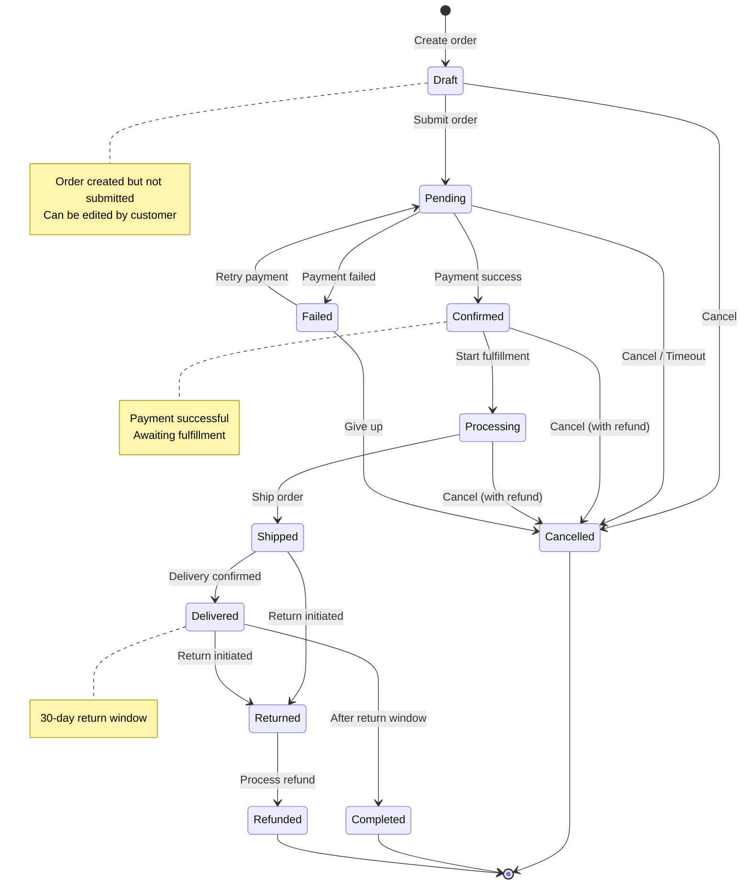

# Order State Machine

State diagram showing order lifecycle.



## State Descriptions

| State | Description | Next States |
|-------|-------------|-------------|
| **Draft** | Order created, not submitted | Pending, Cancelled |
| **Pending** | Awaiting payment confirmation | Confirmed, Failed, Cancelled |
| **Confirmed** | Payment received | Processing, Cancelled |
| **Processing** | Being prepared for shipment | Shipped, Cancelled |
| **Shipped** | In transit to customer | Delivered, Returned |
| **Delivered** | Received by customer | Completed, Returned |
| **Completed** | Order finished successfully | (terminal) |
| **Cancelled** | Order cancelled | (terminal) |
| **Failed** | Payment failed | Pending, Cancelled |
| **Returned** | Return in progress | Refunded |
| **Refunded** | Money returned to customer | (terminal) |

## State Transition Rules

```typescript
const ORDER_TRANSITIONS: Record<OrderStatus, OrderStatus[]> = {
  draft: ['pending', 'cancelled'],
  pending: ['confirmed', 'failed', 'cancelled'],
  confirmed: ['processing', 'cancelled'],
  processing: ['shipped', 'cancelled'],
  shipped: ['delivered', 'returned'],
  delivered: ['completed', 'returned'],
  completed: [],
  cancelled: [],
  failed: ['pending', 'cancelled'],
  returned: ['refunded'],
  refunded: [],
};

function canTransition(from: OrderStatus, to: OrderStatus): boolean {
  return ORDER_TRANSITIONS[from].includes(to);
}
```
